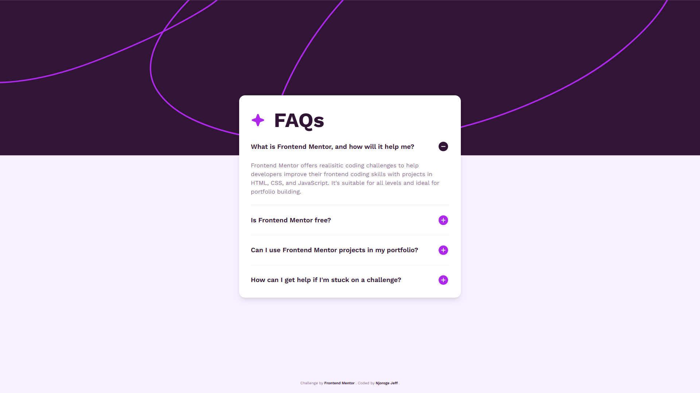

# Frontend Mentor - FAQ Accordion Solution

This is a solution to the [FAQ Accordion Challenge on Frontend Mentor](https://www.frontendmentor.io/challenges/faq-accordion-wyfFdeBwBz). Frontend Mentor challenges help you improve your coding skills by building realistic projects.

## Table of Contents

- [Overview](#overview)
  - [The Challenge](#the-challenge)
  - [Screenshot](#screenshot)
  - [Links](#links)
- [My Process](#my-process)
  - [Development](#development)
  - [Built With](#built-with)
  - [What I Learned](#what-i-learned)
  - [Continued Development](#continued-development)
  - [Useful Resources](#useful-resources)
- [Author](#author)
- [Acknowledgments](#acknowledgments)

## Overview

### The Challenge:

Users should be able to:

- Hide/Show the answer to a question when the question is clicked
- Navigate the questions and hide/show answers using keyboard navigation alone
- View the optimal layout for the interface depending on their device's screen size
- See hover and focus states for all interactive elements on the page

### Screenshot

[](https://faq-accordion-proj.vercel.app/)

### Links

- Solution URL: [FAQ Accordion Solution CodeBase](https://github.com/njorogejeff/faq-accordion)
- Live Site URL: [FAQ Accordion Solution Live Preview](https://faq-accordion-proj.vercel.app/)

## My Process

### Development

The JavaScript functionality enables interactive behavior for a group of elements on a webpage, typically used for FAQ sections or accordions. It first selects all elements with the class `.question` and stores them in the questions NodeList. Each `.question` element is expected to contain a button with the class `.question-btn`.

For every `.question` element, the code locates its corresponding `.question-btn` and attaches a click event listener. When the button is clicked, the code iterates through all `.question` elements. If an element is not the one that was clicked, it removes the `show-text` class from it, ensuring that only one question can be expanded at a time.

Finally, the clicked question toggles its own `show-text` class. This means if the question was collapsed, it expands to show its content; if it was already expanded, it collapses. This approach provides a clean and user-friendly way to display only one answer at a time, improving readability and user experience.

A subtle but important detail is the use of `item !== question` to avoid collapsing the currently clicked question before toggling its state. This prevents unexpected behavior and ensures the toggle works as intended.

### Built with

- Semantic HTML5 markup
- Tailwind CSS
- Vite
- Mobile-first workflow
- [Tailwind CSS](https://tailwindcss.com/) - CSS Framework
- [Vite](https://vite.dev/) - Build Tool

### What I Learned

The major obstacle to this project came to the implementation of the FAQ Accordion functionality. The functionality invovles the following:
- Finds all elements with the class `.question`.
- For each question, finds its child button with class `.question-btn`.
- On button click:
  - Closes all other questions by removing the `show-text` class.
  - Toggles `show-text` on the clicked question to open/close it.

Code snippets:

```html
<article class="question">
  <!-- FAQ Question -->
  <section class="question-title">
    <h2 >What is Frontend Mentor, and how will it help me?</h2>
    <button class="question-btn">
      <span class="plus-icon">
        
      </span>
      <span class="minus-icon">
        
      </span>
    </button>
  </section>

  <!-- FAQ Answer -->
  <section class="question-text">
    <p>Frontend Mentor offers realisitic coding challenges ...</p>
  </section>
</article>
```

```css
/* hide text (default) */
.question-text {
  display: none;
}
.show-text .question-text {
  display: block;
}
.minus-icon {
  display: none;
}
.show-text .minus-icon {
  display: inline;
}
.show-text .plus-icon {
  display: none;
}
```

```js
btn.addEventListener("click", function () {
  questions.forEach(function (item) {
    if (item !== question) {
      item.classList.remove("show-text");
    }
  });

  question.classList.toggle("show-text");
});
```

### Continued Development

-  Addition of a null check. For missing buttons, if a `.question` has no `.question-btn`, `question.querySelector` returns `null` and `addEventListener` will throw.
- Static NodeList: `querySelectorAll` returns a static list. Dynamically added questions won’t be handled unless I re-run this setup or use event delegation.
- Performance: Each click loops through all questions (O(n)). This is fine for small lists; for large lists, I could track the currently open item.
Accessibility: I am considering managing aria-expanded and aria-controls so screen readers get state changes. This ensures keyboard users can toggle via Enter/Space.
- `NodeList.prototype.forEach` isn’t supported in very old browsers (like IE). I am considering to convert to an array or use a `for...of` loop.

### Useful Resources

- [Tailwind CSS - Getting Started](https://tailwindcss.com/docs/installation) - This resource provided me with the necessary information to get started with Tailwind CSS and additional styling.
- [FreeCodeCamp - How to create a FAQ page](https://www.freecodecamp.org/news/javascript-projects-for-beginners/#heading-how-to-create-a-faq-page) - This tutorial helped me learn how to create a Frequently Asked Questions (FAQ) Page.

## Author

- GitHub - [Njoroge Jeff](https://github.com/njorogejeff/)
- Frontend Mentor - [@njorogejeff](https://www.frontendmentor.io/profile/njorogejeff)

## Acknowledgments

- Thanks to [Frontend Mentor](https://www.frontendmentor.io/) for the challenge and design assets.
- The [Tailwind CSS](https://tailwindcss.com/) and [Vite](https://vite.dev/) teams for excellent docs and tooling.
- This helpful [freeCodeCamp article on building a FAQ page](https://www.freecodecamp.org/news/javascript-projects-for-beginners/#heading-how-to-create-a-faq-page) for guidance.
- The Frontend Mentor community for shared insights and feedback.
